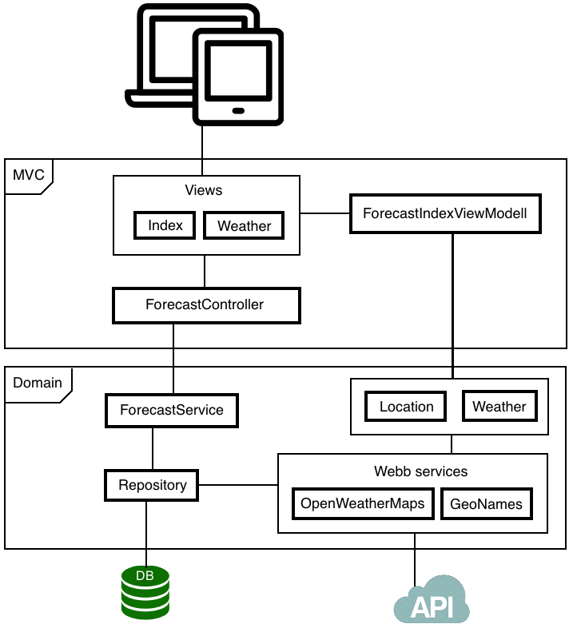

### Inledning

Projektet är en väderapplikation som kan söka upp väder prognoser i hela världen med hjälp av API:erna från GeoNames.com samt openWeatherMap.com.
Applikationen fungerar genom att användaren söker på en plats och får upp matchande platser i en lista. Vid val av plats kommer en sida visa en femdygns prognos över platsen.
Jag valde att göra en väderapplikation då det fanns möjlighet att bygga vidare på det rekommenderade projektet i 1DV409 kursen.

Det finns väldigt många liknande applikationer, kanske inte så konstigt med tanke på att flera utav dem har något form av API som man kan använda sig av och gör det enkelt att skapa sin egna väderapplikation. 

### Schematisk bild

### Säkerhet

Applikationen bygger på ASP.NET MVC som har inbyggt skydd mot skadlig indata som förhindra mot XSS-attacker, även ramverket Razor som används i vyerna har skydd mot indata. 
Databasen använder ramverket Entity Framework och frågespråket LINQ som ger skydd för SQL-injections.
Hjälp metoden AntiForgeryToken som ger skydd mot CRSF attacker är utkommenterad då token value cachas dessvärre med appcache.
Jag ser dock inte detta som en säkerhetsrisk i applikationen då det finns ingen anledning att göra en CSRF attack på applikationen. 
All databas kommunikation sker genom användaren Appuser som har särskilda rättigheter.

### Prestandaoptimering

All CSS och JavaScript/jQuery bibliotek är av minimerad version. Alla CSS filer ligger i header sektionen och JavaScript/jQuery ligger sist i body sektionen. Applikationen använder appcache för att cacha allt statisk på sidorna som ger en snabbare sidladdning.
All data som hämtas från API:erna cachas i en databasen.

### Offline-first

Applikationen använder sig av appcache som cacha allt statisk på sidan och de sidor som användaren har besökt innan kan användaren besöka offline. Sidan som visar väderprognosen spara url'en i localstorage, när användaren blir offline kommer en lista med sökta platser visas som hämtas från localstorage.
Med hjälp av Checknet som är ett plugin till jQuery som pingar applikationen med jämna mellanrum kan applikationen känna av om man har någon kontakt. Scriptet pingar filen ping.html med ett intervall på 5 sekunder för att se om det finns någon kontakt. Vid offline kommer applikationen talar om detta och sidan får en minskad funktionalitet på sidan.

### Risker med din applikation

Applikationen förlitar sig helt på att API:ernas struktur och användnings villkor förbli oförändrade.

### Egen reflektion kring projektet

I helhet har projektet gått bra och jag har till största del fått den hjälp jag behöver genom att praktiskt tillämpa den teori vi har fått lära oss i paralell kursen.
Att använda sig av appcache samt localstorage var förvånansvärt enkelt, jag hade räknat med att det skulle vara mer kod att implementera.
Jag har haft en del svårigheter med att läsa ut data från API:erna samt hantera vissa förändringar som sker i API:ets data. Det har varit lite problematiskt med appcache då den cacha allt och det har skapat vissa problem exempelvis cachat token value i post formuläret samt ping funktionen med Checknet pingar cachad sida som gör att pingen alltid får status 200 när man är offline. 
Jag tycker projektet har varit väldigt utvecklande och fått lära mig många nya tekniker. 
Offline-first är något helt nytt för mig och jag kommer definitivt använda mig av det i mina nästkommande projekt. 
Som vanligt funkar applikationen problemfritt localt men dessvärre inte vid publicering, detta har inte varit några större problem då med beskrivande felmeddelandet blev det lätt att åtgärda problemen.

### betygshöjande med din applikation

